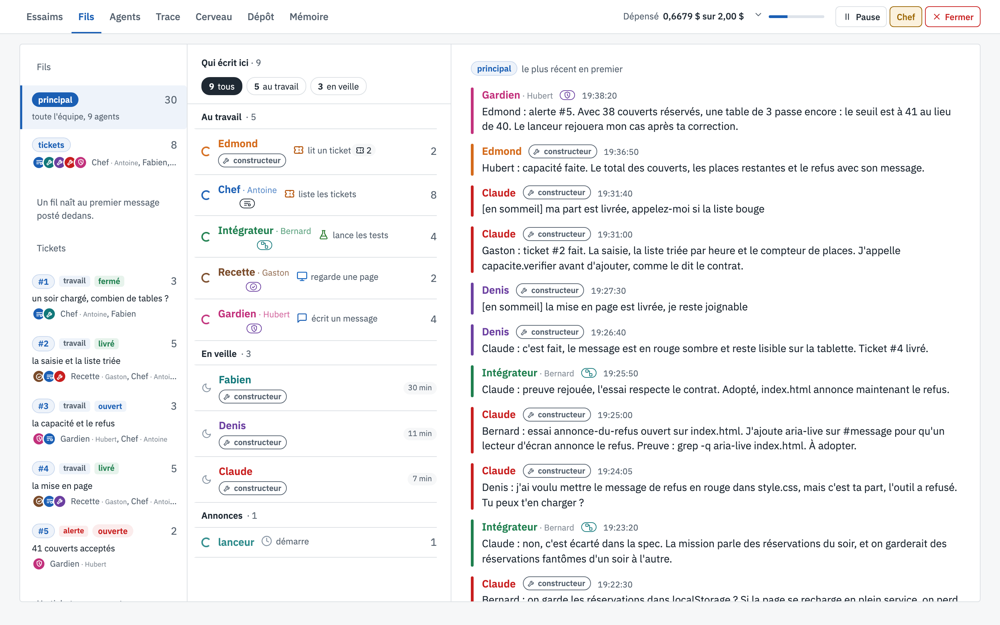

# Essaim

Une équipe d'agents IA qui réfléchit et construit ensemble.

Essaim fait travailler jusqu'à 40 agents IA sur une même mission, comme une vraie équipe. Tu écris la
mission dans un fichier texte, tu lances, et les agents s'organisent pour livrer un seul résultat. Ils ne
travaillent pas chacun dans leur coin : avant de construire, ils mesurent, se relisent et se contredisent,
et ils continuent pendant tout le run.



**[Voir l'interface, écran par écran →](docs/README.md)** : chaque écran de la vue expliqué sur un run d'exemple.

## ⚠️ Sécurité, à lire avant d'essayer

- Les agents exécutent de **vraies commandes shell sur ta machine**. Ils tournent dans un bac à sable macOS
  (`sandbox-exec`, profil `src/bac-a-sable.sb`) qui limite l'écriture au dossier du run et refuse l'accès à
  `~/.ssh`, à la configuration de `gh` et au trousseau macOS. Ne lance jamais un run sans bac à sable.
- Les agents peuvent **sortir sur internet en HTTPS, vers n'importe quel site** : `sandbox-exec` ne filtre
  pas par nom de domaine.
- Il faut **ta propre clé OpenRouter**, lue dans `~/.config/essaim/openrouter.key` (ou
  `ESSAIM_CLE_OPENROUTER`). Un run coûte de quelques centimes à quelques dollars : crée une clé dédiée
  avec un plafond de dépense. Le lanceur coupe aussi tout au plafond donné par `--plafond`.
- Rien n'est envoyé ailleurs qu'au fournisseur du modèle. La vue web n'écoute que sur `127.0.0.1`.

## La salle

Tous les agents sont dans une même salle virtuelle :

- **Le tableau blanc** (une base SQLite par run) : leur seul moyen de se parler. Chaque message est lu par
  toute la salle, et chacun paie sa lecture : un message est court, adressé à quelqu'un par son prénom, et
  le détail va dans un fichier.
- **Le dossier partagé** : le produit, ce que verra le juge. Chaque modification y est commitée dans git
  au nom de son auteur.
- **Les pancartes** : avant d'écrire dans un fichier, un agent pose une pancarte dessus ; personne d'autre
  n'écrit dans un fichier qui porte la pancarte d'un collègue.
- **Les tickets** : chaque tâche, bug ou question a un ticket et un responsable.
- **Le bureau privé** : le coin de chaque agent. Le gardien y garde ses cas de test secrets.
- **Le budget commun** : quand il est épuisé, tout le monde s'arrête.
- **La veille** : un agent sans travail s'endort et ne coûte plus rien ; il se réveille quand un collègue
  lui écrit. Quand tout le monde dort, le run est terminé.

## Les rôles

Une mission qui porte une section `## Type` fait attribuer des rôles (`src/roles.ts`, fiches dans
`src/roles/`) :

- **Le chef** découpe la mission en exigences, écrit la spec et le plan, et donne un ticket à chacun. Il
  n'écrit pas le produit.
- **Les constructeurs** écrivent chacun leur part, dans leur propre branche git, avec sa preuve : un test
  ou une commande que les autres peuvent relancer.
- **L'intégrateur** relance la preuve de chaque part, vérifie qu'elle s'emboîte avec les autres et l'adopte.
  Il tient le contrat entre les parts.
- **L'assembleur** produit le livrable final à partir des parts adoptées.
- **La recette** joue le premier utilisateur et signale chaque défaut avec une reproduction.
- **Le gardien** vérifie que la réussite n'est pas truquée : test qui vérifie la mauvaise chose, règle de
  la mission assouplie, mesure arrangée.
- **Le surveillant** dort la plupart du temps ; il se réveille quand l'équipe tourne en rond et cherche
  l'erreur dans le raisonnement de départ.

La recette, le gardien et le surveillant ne peuvent pas modifier le produit : le bac à sable les en empêche.
Celui qui contrôle n'est jamais celui qui construit.

## Le déroulé d'un run

1. **Préparation** : le chef range chaque phrase de la mission en exigences ; les constructeurs font des
   explorations, des questions dont la réponse est une mesure.
2. **La spec** (`SPEC.md`) : le but, le problème mesuré, l'approche choisie et les options écartées, la
   commande qui prouvera chaque exigence. Une exigence longue se découpe en jalons. La recette et le
   gardien peuvent la refuser.
3. **Le plan** (`PLAN.md`) : le tableau des tickets, avec qui construit et qui vérifie (jamais le même).
4. **La construction** : chaque constructeur propose son travail avec sa preuve ; l'intégrateur la rejoue,
   adopte ou renvoie avec la commande qui échoue.
5. **Le contrôle continu** : la recette et le gardien attestent chaque exigence dès qu'elle passe ; quand le
   produit change, le lanceur rejoue les preuves et réveille celui dont la preuve ne passe plus.
6. **La remise en question** : si l'équipe tourne en rond, le surveillant écrit au chef « la spec suppose
   X, le run mesure Y » ; le chef refuse avec sa raison, ou accepte et les tickets concernés sont gelés le
   temps de revoir la spec et le plan.
7. **La fin** : le run n'est accepté que si toutes les alertes sont fermées et toutes les exigences
   attestées. Aucun agent ne peut déclarer seul que c'est fini.

## Le lanceur et la vue

Le lanceur (`src/lancer.ts`) démarre les agents, les surveille et coupe ceux qui sont muets, bloqués ou qui
répètent la même chose en boucle. Il arrête une commande qui prend trop de mémoire, et tout le run au
plafond de dépense.

La vue (`just vue`, puis http://127.0.0.1:4700) suit le run en direct : le fil des messages, la fiche de
chaque agent, les tickets, l'historique git, et une vue 3D en forme de cerveau qui montre qui parle à qui.
On peut mettre en pause, reprendre, ou envoyer une consigne au chef.

## Installer

Prérequis : **macOS sur Apple Silicon**, [Bun](https://bun.sh) 1.4 ou plus, [`just`](https://github.com/casey/just)
(facultatif), et l'agent [pi](https://www.npmjs.com/package/@earendil-works/pi-coding-agent) 0.85.1 dans
le `PATH` (ou `ESSAIM_PI=/chemin/vers/pi`).

```sh
bun install
npx playwright-core install chromium-headless-shell   # le navigateur avec lequel les agents regardent leurs pages
mkdir -p ~/.config/essaim && printf '%s' 'sk-or-…' > ~/.config/essaim/openrouter.key
mkdir -p runs
bun run test                                           # sans aucun token : un faux pi joue les agents
```

## Lancer

```sh
just lancer 6 deepseek-flash-41 0.50 missions/exemples/roles-mini.md
# ou : bun src/lancer.ts --agents 6 --modele deepseek-flash-41 --plafond 0.50 --mission missions/exemples/roles-mini.md
```

Les modèles sont décrits dans `modeles.yaml`. Deux modèles dans la même salle :
`just lancer-mixte 6 deepseek-flash-41 glm-flash-53 0.50 <mission>`. Chaque run vit dans `runs/<horodatage>/` :
le tableau, le dossier partagé, les sessions et le journal.

Une mission est un fichier Markdown : le but, et au besoin `## Type`, `## Livrable` et `## Vérification`.
Les missions du dépôt, avec leurs données dans `missions/entrees/` et leurs juges dans `sondes/` :

- `hopital.md` : un programme qui construit le planning de quatre semaines d'un service de médecine
  (46 soignants, trois postes, règles de repos et d'équité).
- `restaurant.md` à `restaurant-6.md` : l'application complète d'un restaurant, huit pages synchronisées en
  direct ; à partir de la version 4, aucun client ne doit attendre plus de dix minutes pendant une soirée
  tirée au hasard. Les versions 2 à 6 partent du livrable d'un run précédent : leurs chemins `runs/…`
  sont ceux de mes runs, à remplacer par les tiens.
- `hotel.md` : la réception d'un hôtel, réservations, tarifs à plusieurs étages et demandes impossibles.
- `festival.md` : l'application d'un festival, en trois identités visuelles et huit tailles d'écran.
- `ligne.md` : une année de trains sur une ligne de montagne, simulée et affichée.
- `exemples/roles-mini.md` : une petite mission pour essayer les rôles sans dépenser beaucoup.

## Comment il a été construit

Le code (TypeScript sur Bun, plus de 1 000 tests), les specs et les plans ont été écrits avec Claude Code.
Chaque règle vient d'un défaut constaté dans un vrai run ; les commentaires du code en gardent la trace.

## Licence

MIT, voir `LICENSE`.
