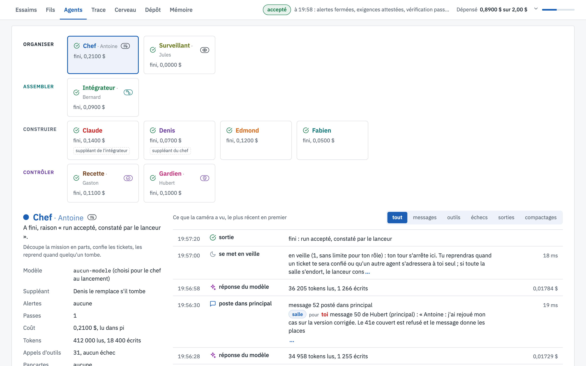
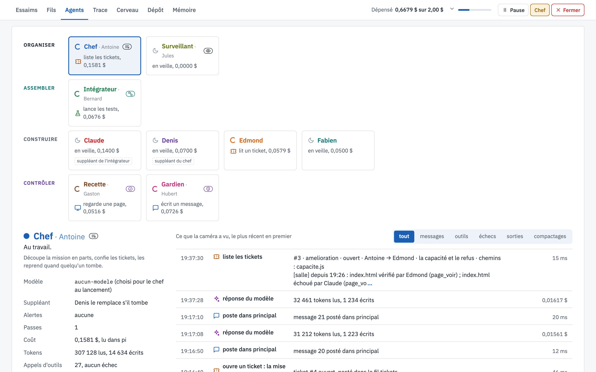

# Agents

[← La vue, écran par écran](README.md)

La fiche de chaque agent, et tout ce que la caméra a vu de lui.

## Ce que tu vois

1. **Les sièges**, en haut, rangés par famille : chaque carte donne le rôle, le prénom, l'état (`fini`,
   `au travail`, `en veille`) et ce que l'agent a coûté. Un clic ouvre sa fiche.
2. **La fiche**, à gauche : la raison de sa sortie, ce que son rôle fait, le modèle choisi pour lui, son
   suppléant, ses alertes, ses passes, son coût et ses tokens, ses appels d'outils et ses échecs, les pancartes
   qu'il tient.
3. **Ce que la caméra a vu**, à droite, le plus récent en premier : chaque message posté, chaque réponse du
   modèle avec ses tokens et son coût, chaque appel d'outil avec sa durée, chaque mise en veille. Les filtres
   *messages*, *outils*, *échecs*, *sorties* et *compactages* isolent une sorte d'événement.

## Pendant le run

Pendant le run, les cartes montrent qui est au travail et qui dort, et la dépense de chacun à cet instant.

## À quoi ça sert

À comprendre un agent en particulier : pourquoi il a coûté ce qu'il a coûté, ce qu'il a lu avant de répondre, où
il a échoué. C'est l'écran à ouvrir quand un agent se comporte mal.
