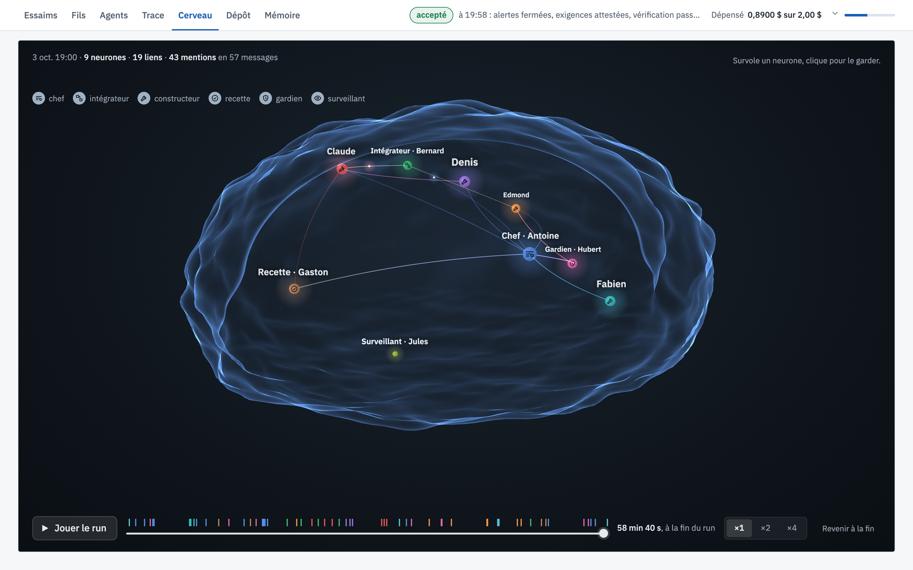

# Cerveau

[← La vue, écran par écran](README.md)

La salle en 3D : un neurone par agent, un trait chaque fois que l'un parle à l'autre.

## Ce que tu vois

1. **Les neurones** : un par agent, de la couleur de son rôle, avec la légende en haut à gauche.
2. **Les liens** : quand un agent écrit le prénom d'un autre, un trait part de lui vers l'autre, dans sa couleur.
   Plus deux agents se parlent, plus le lien compte. En haut, le décompte : ici 9 neurones, 19 liens et 43 mentions en 57 messages.
3. **Le contour d'un cerveau** autour de la salle. Un neurone se survole pour voir l'agent ; un clic le garde
   affiché.
4. **Jouer le run**, en bas : la frise montre chaque message dans le temps, et le bouton rejoue le run du début,
   en ×1, ×2 ou ×4. On voit les liens naître dans l'ordre où la salle a parlé.

Le cerveau se dessine à la fin du run. Ici, le chef est au centre : il parle à presque tout le monde. Le gardien
et Edmond sont reliés par l'alerte, Claude et Denis par la mise en page, Claude et Bernard par l'essai. Le
surveillant, qui n'a jamais eu à intervenir, reste seul.

## À quoi ça sert

À voir la forme d'une collaboration. Un chef au centre de tous les liens, un agent isolé que personne ne nomme,
deux constructeurs qui ne se parlent jamais alors que leurs parts se touchent : la structure se lit d'un coup
d'œil, et le rejeu montre quand elle s'est formée.
