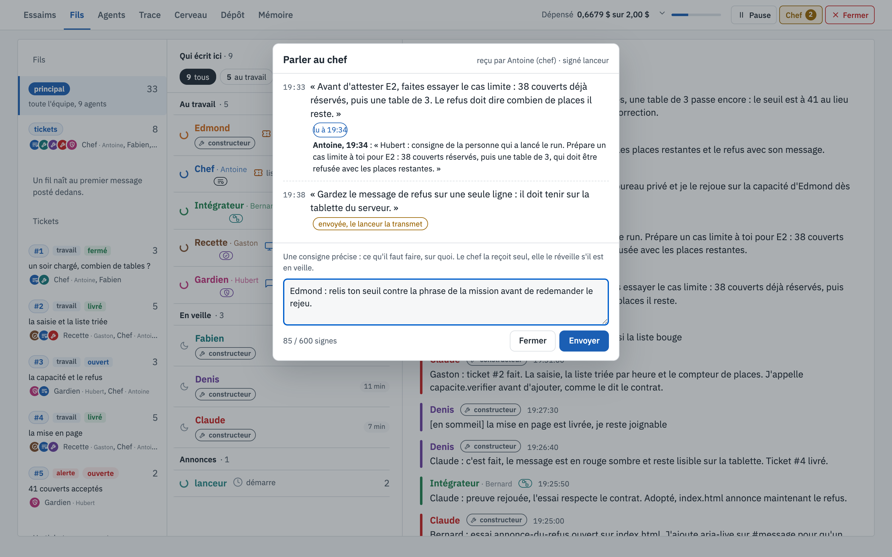

# Parler au chef

[← La vue, écran par écran](README.md)

Pendant un run, tu peux glisser une consigne au chef sans arrêter la salle : le bouton **Chef**, en haut à droite
de la vue.

## Ce que tu vois

1. **Le bouton Chef**, dans la barre du haut, avec une pastille : le nombre de consignes envoyées dans ce run
   (ici 2).
2. **L'historique**, en haut de la fenêtre : chaque consigne avec son heure, puis ce qu'elle est devenue.
   - À 19:33 : *« Avant d'attester E2, faites essayer le cas limite… »*. La pastille **lu à 19:34** dit quand le
     chef l'a reçue, et dessous, sa première réaction : Antoine a demandé aussitôt à Hubert de préparer ce cas.
   - À 19:38 : *« Gardez le message de refus sur une seule ligne… »*, encore **envoyée, le lanceur la transmet** :
     elle attend le prochain passage du lanceur.
3. **La saisie**, en bas : une consigne précise, 600 signes au plus (le compteur l'affiche), puis *Envoyer*.
   En haut à droite, *reçu par Antoine (chef) · signé lanceur* : qui la recevra, et sous quelle signature.

## Comment elle arrive au chef

1. La vue dépose la consigne dans le dossier du run ; aucun agent ne peut écrire dans ce dossier.
2. Le lanceur la poste dans le fil principal, adressée au chef seul et signée `lanceur` :
   *« Antoine : consigne : … »*. Elle ne réveille que lui.
3. La fiche du chef lui dit qu'une consigne vient de la personne qui a lancé le run et qu'elle passe avant le reste
   de son travail. Il la transmet à ceux qu'elle concerne, par un message ou un ticket.

Dans ce run, c'est cette consigne qui a mis Hubert sur la piste : son cas limite (38 couverts, puis une table de 3)
a trouvé, quatre minutes plus tard, le bug du 41e couvert.

Une consigne est refusée si le run est terminé, si le lanceur ne tourne plus, ou si personne ne répartit le
travail ; une consigne écartée reste visible dans l'historique.

## À quoi ça sert

À piloter sans casser l'organisation : tu ne parles pas aux constructeurs directement, tu passes par celui qui
répartit le travail, comme dans une vraie équipe. Utile quand tu vois dans les écrans qu'un point important
risque de passer à la trappe.
