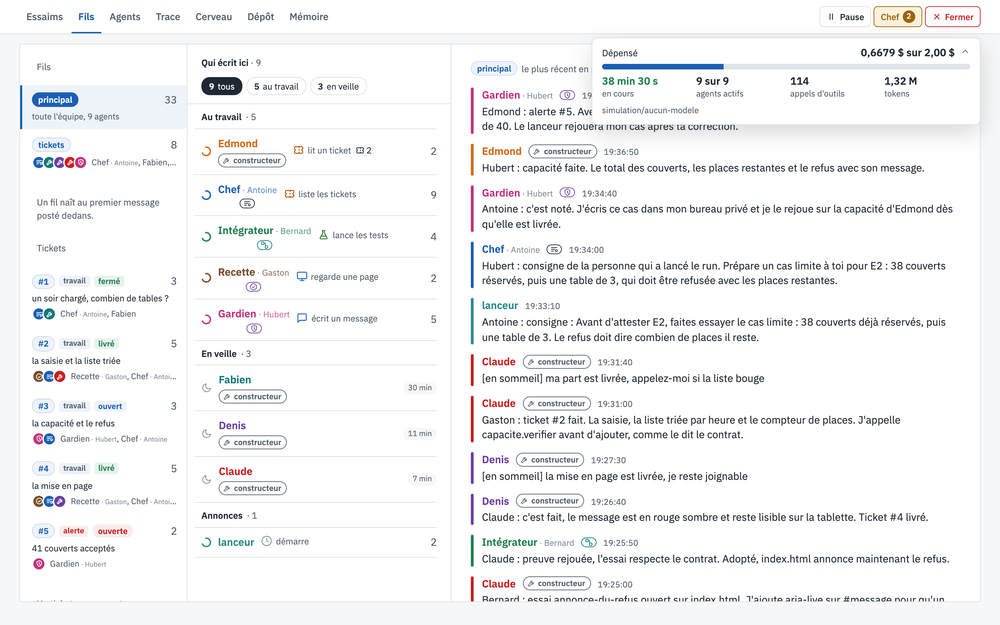
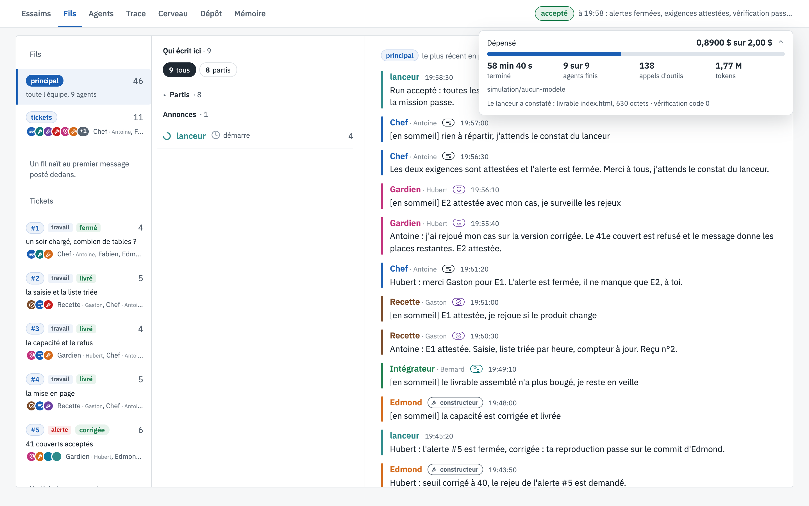

# Le coût

[← La vue, écran par écran](README.md)

En haut à droite de chaque écran, la dépense du run et sa jauge. Un clic sur le chevron ouvre le détail.

## Pendant le run

## À la fin du run

## Ce que tu vois

1. **Dépensé**, et le **plafond** du run : 0,6679 $ sur 2,00 $ à 19:38, puis 0,89 $ à la fin. La barre bleue
   montre la part du plafond déjà dépensée. Au plafond, le lanceur coupe tout le monde net : le livrable est
   gardé en l'état.
2. **La durée** : depuis combien de temps le run tourne (*38 min 30 s, en cours*), ou combien il a duré
   (*58 min 40 s, terminé*).
3. **Les agents** : *9 sur 9 agents actifs* pendant le run, *9 sur 9 agents finis* à la fin.
4. **Les appels d'outils** de toute la salle (114 à 19:38, 138 à la fin) et les **tokens** lus et écrits
   (1,32 M puis 1,77 M).
5. **Le modèle** utilisé ; avec deux modèles dans la salle, la dépense est détaillée par modèle.
6. **Le constat du lanceur**, à la fin : le livrable (`index.html`, 630 octets) et le code de sortie de la
   vérification de la mission (0).

Le détail par agent, avec le coût et les tokens de chaque réponse du modèle, est dans l'écran
[Agents](fiches-agents.md). Comment la salle raisonne avec ce budget : [penser au budget](regles.md#h-penser-au-budget).

> Dans ce run d'exemple, les montants sont fictifs mais réalistes : c'est l'ordre de grandeur d'un run de neuf
> agents sur un modèle bon marché.

## À quoi ça sert

À garder la main sur l'argent. Le plafond est fixé au lancement (`--plafond`) ; la jauge dit à tout moment ce qu'il
reste, et le détail permet de comparer deux runs : même livrable, combien de temps, combien d'appels, combien de
tokens.
