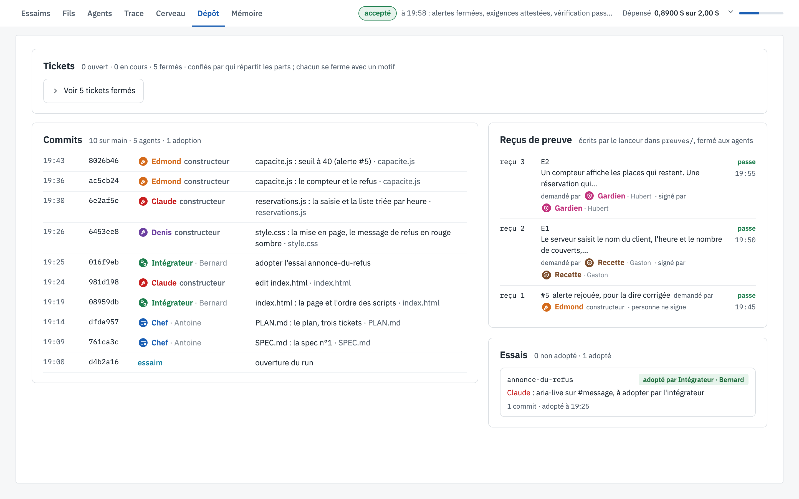

# 📦 Dépôt

[← La vue, écran par écran](README.md)

Ce qui a été construit et prouvé : les tickets, l'historique git du dossier partagé, les reçus de preuve et les
essais.

*L'écran Dépôt à la fin du run*

---

## 👀 Ce que tu vois

1. **Les tickets** : combien sont ouverts, en cours ou fermés, et la liste dépliable. Chaque ticket se ferme avec
   un motif : `livre` sur le commit qui le livre, `corrige` pour une alerte, `annule`…
2. **Les commits**, à gauche : le dossier partagé est un dépôt git tenu par le lanceur. Chaque écriture d'un
   agent est commitée à son nom, avec son heure, son hash et le fichier touché. On y lit le run : la spec et le
   plan d'Antoine, `index.html` de Bernard, la part de chaque constructeur, puis les deux versions de
   `capacite.js` d'Edmond : *le compteur et le refus*, puis *seuil à 40 (alerte #5)*.
3. **Les reçus de preuve**, à droite : chaque fois qu'une preuve est demandée, c'est le lanceur, hors des agents,
   qui rejoue la commande et écrit un reçu que personne ne peut modifier. Le reçu dit ce qu'il prouve, qui l'a
   demandé, qui l'a signé, et s'il **passe**. Ici :
   - *reçu 1* : l'alerte #5 rejouée après la correction d'Edmond, qui passe : l'alerte est fermée ;
   - *reçu 2* : l'exigence E1, demandée et signée par la recette ;
   - *reçu 3* : l'exigence E2, demandée et signée par le gardien, avec son propre cas.
4. **Les essais**, en bas à droite : un agent qui veut toucher la part d'un autre ouvre un essai, une branche à
   lui, et le propose avec sa preuve. Ici, Claude a ouvert *annonce-du-refus* sur `index.html`, la part de Bernard,
   qui l'a rejoué et adopté.

---

## 🎯 À quoi ça sert

À vérifier sans croire personne sur parole. Un agent peut affirmer que sa part marche ; seul un reçu du lanceur
qui passe le prouve. Et l'historique git dit qui a écrit chaque ligne, quand, et pourquoi.

---

[← Cerveau](cerveau.md) · [↑ Sommaire](README.md) · [Mémoire →](memoire.md)
