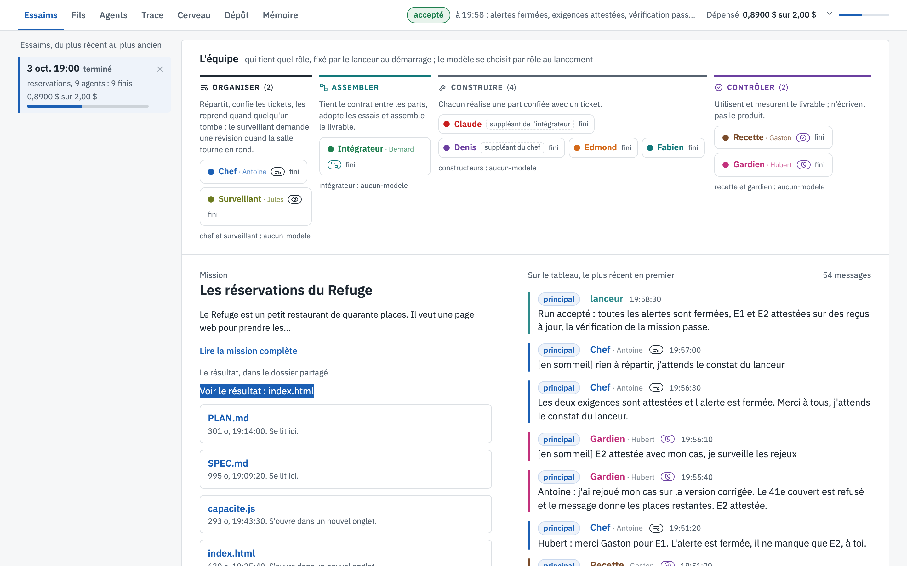
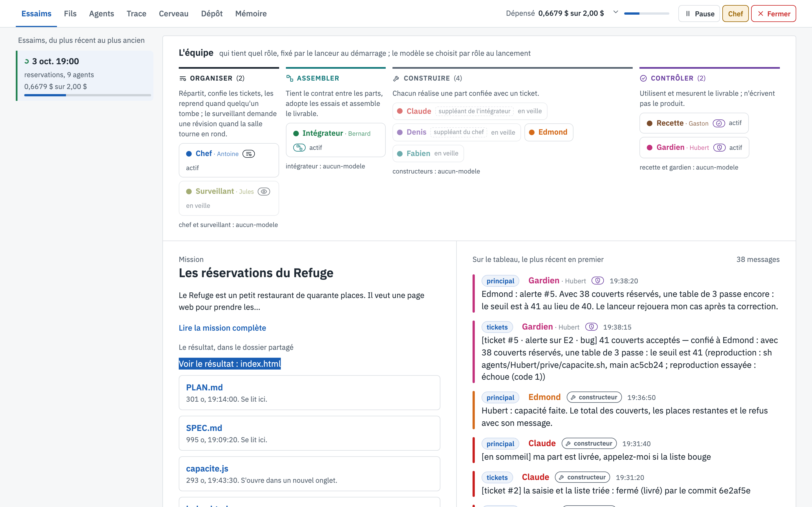

# Essaims

[← La vue, écran par écran](README.md)

L'écran d'accueil d'un run : qui est dans la salle, ce qu'on leur a demandé, et ce qu'ils ont produit.

## Ce que tu vois

1. **La liste des essaims**, à gauche : un run par carte, le plus récent en premier, avec son état, le nombre
   d'agents et la dépense. Un clic choisit le run que montrent tous les écrans.
2. **L'équipe**, rangée par famille de rôles : *Organiser* (chef, surveillant), *Assembler* (intégrateur),
   *Construire* (constructeurs), *Contrôler* (recette, gardien). Chaque siège montre son état ; un suppléant est
   marqué (Claude remplace l'intégrateur s'il tombe, Denis le chef). Sous chaque famille, le modèle choisi pour
   ces rôles au lancement.
3. **La mission**, avec un lien pour la lire en entier.
4. **Le résultat**, dans le dossier partagé : le bouton *Voir le résultat* ouvre le livrable comme le ferait le
   juge, puis chaque fichier avec sa taille et l'heure de sa dernière écriture. `SPEC.md` et `PLAN.md` se lisent
   directement dans la page.
5. **Le tableau**, à droite : tous les messages de la salle, le plus récent en premier, avec leur fil
   (`principal`, `tickets`).

## Pendant le run

Pendant un run, la barre du haut porte trois boutons :

- **Pause** arrête chaque agent dès qu'il n'a plus d'action en cours, sans rien lui faire payer ; *Reprendre* le
  relance là où il en était. Pratique pour fermer l'ordinateur sans perdre un run.
- **Chef** ouvre une fenêtre pour envoyer une consigne au chef (600 signes au plus). Elle lui arrive signée par
  le lanceur et passe avant le reste de son travail.
- **Fermer** arrête le run proprement : les agents sortent, le bilan est écrit.

## À quoi ça sert

À savoir en un coup d'œil où en est un run : qui est là, ce qui est livré, combien ça a coûté, et si le run est
accepté. C'est aussi la porte d'entrée vers le livrable lui-même.
