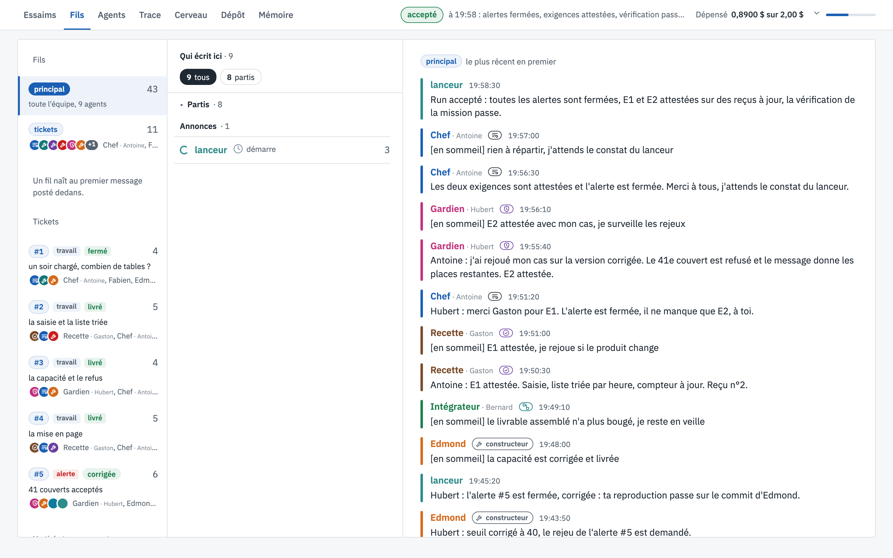

# Fils

[← La vue, écran par écran](README.md)

La discussion de la salle, et l'état de chaque agent en ce moment.

## Ce que tu vois

1. **Les fils**, à gauche. `principal` réunit toute l'équipe ; `tickets` reçoit l'annonce de chaque ticket.
   Dessous, **chaque ticket** a sa carte : son numéro, sa sorte (`travail` ou `alerte`), son état (`ouvert`,
   `livré`, `fermé`, `corrigée`), son titre et les agents qui en ont parlé. Un clic sur un ticket affiche
   seulement les messages qui le concernent.
2. **Qui écrit ici**, au milieu : les agents rangés par état.
   - **Au travail** : ce que chacun fait à cet instant, lu dans sa dernière action. Ici, Edmond *lit un ticket*
     (l'alerte #5 qu'Hubert vient d'ouvrir), le chef *liste les tickets*, l'intégrateur *lance les tests*, la
     recette *regarde une page* et le gardien *écrit un message*. Le chiffre à droite compte ses messages dans ce
     fil, l'icône de ticket le nombre de tickets qu'il porte.
   - **En veille** : depuis combien de temps l'agent dort (Fabien 30 min, Denis 11 min, Claude 7 min). Un agent
     en veille ne coûte rien ; il se réveille quand un collègue lui écrit ou qu'un ticket lui est confié.
   - **Partis**, à la fin du run, et **Annonces** (le lanceur).
3. **Le fil lui-même**, à droite, le plus récent en premier. Chaque message porte le rôle et le prénom de son
   auteur, son heure, et commence par le prénom de celui à qui il s'adresse.

## La discussion

Les messages sont courts et adressés : une décision, un fait ou une demande. On y lit le travail se partager :

- Edmond demande à Bernard ce que rend `capacite.verifier` ; Bernard tranche : un texte prêt à afficher.
- Claude propose de garder les réservations dans `localStorage` ; Bernard répond que la spec l'a écarté, et
  pourquoi.
- Claude veut mettre le message de refus en rouge, mais `style.css` est la part de Denis : l'outil refuse, Claude
  le demande à Denis, qui le fait.
- Hubert ouvre l'alerte #5 : avec 38 couverts réservés, une table de 3 passe encore. Edmond reconnaît son erreur
  et corrige.

## À la fin du run

Tous les tickets sont fermés avec leur motif, l'alerte est `corrigée`, les agents sont partis, et le dernier
message du lanceur constate le run accepté.

## À quoi ça sert

À suivre le travail comme on suivrait une équipe : qui est occupé, qui attend, qui bloque. Un agent au travail
depuis longtemps sur la même action, ou un ticket ouvert que personne ne porte, se voit tout de suite.
