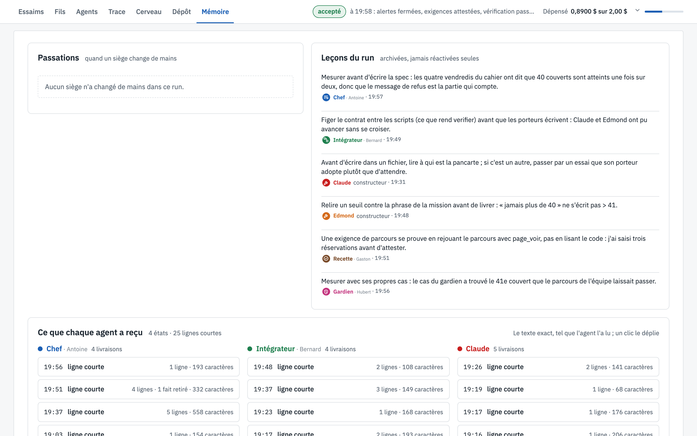

# 🗂️ Mémoire

[← La vue, écran par écran](README.md)

Ce que la salle retient, et ce que chaque agent a réellement reçu.

*L'écran Mémoire à la fin du run*

---

## 👀 Ce que tu vois

1. **Les passations** : quand un agent part en cours de run, un autre reprend son siège avec sa note de
   passation. Aucune ici : aucun siège n'a changé de mains.
2. **Les leçons du run** : en partant, chaque agent peut laisser une leçon. Elles sont archivées, jamais
   réinjectées toutes seules dans un autre run. Dans ce run, par exemple :
   - 🧭 le chef : *mesurer avant d'écrire la spec* ;
   - Edmond : *relire un seuil contre la phrase de la mission : « jamais plus de 40 » ne s'écrit pas > 41* ;
   - 🛡️ le gardien : *mesurer avec ses propres cas : le sien a trouvé le 41e couvert que le parcours de l'équipe
     laissait passer*.
3. **Ce que chaque agent a reçu**, en bas : à chaque réveil ou relance, le lanceur remet à l'agent un état de la
   salle. Chaque livraison est gardée telle que l'agent l'a lue, avec son heure et sa taille ; un clic la
   déplie.

---

## 🎯 À quoi ça sert

À savoir ce qu'un agent savait au moment où il a agi. Quand un agent prend une mauvaise décision, la question
n'est souvent pas « pourquoi a-t-il mal raisonné ? » mais « qu'avait-il sous les yeux ? ». Cet écran y répond.
Les leçons, elles, servent à améliorer les consignes et les outils d'un run à l'autre.

---

[← Dépôt](depot.md) · [↑ Sommaire](README.md) · [Parler au chef →](chef.md)
