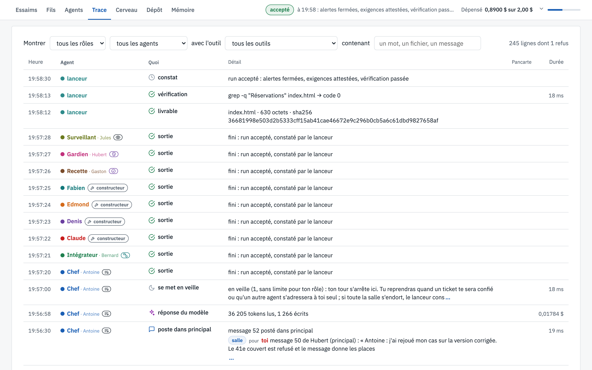

# 🔎 Trace

[← La vue, écran par écran](README.md)

Le journal de toute la salle : chaque appel d'outil, chaque réponse du modèle, chaque geste du lanceur.

*L'écran Trace à la fin du run*

---

## 👀 Ce que tu vois

1. **Les filtres**, en haut : par rôle, par agent, par outil, et une recherche libre (un mot, un fichier, un
   message). À droite, le nombre de lignes et de refus.
2. **Une ligne par événement**, le plus récent en premier : l'heure, l'agent, ce qu'il fait (en clair : *poste
   dans principal*, *se met en veille*, *réponse du modèle*…), le détail, la pancarte concernée et la durée ou le
   coût.
3. ⚙️ **Les gestes du lanceur**, signés `lanceur` : ici, à la fin, la sortie de chaque agent, puis le *livrable*
   (le fichier, sa taille et son empreinte sha256), la *vérification* de la mission (`grep -q "Réservations"
   index.html → code 0`) et le *constat* : run accepté.

Dans ce run, la trace compte 245 lignes, dont **un refus** : Claude a voulu écrire `style.css`, la part de Denis,
et l'outil a répondu *« style.css est la part de Denis »*. On y trouve aussi une erreur passagère du fournisseur
chez Hubert, relancée sans lui faire perdre de passe.

---

## 🎯 À quoi ça sert

À enquêter. Quand un run tourne mal, la trace dit exactement qui a fait quoi, dans quel ordre et ce que ça a
coûté. Le filtre *avec l'outil* montre par exemple toutes les vérifications de page, ou toutes les écritures
d'un fichier.

---

[← Agents](fiches-agents.md) · [↑ Sommaire](README.md) · [Cerveau →](cerveau.md)
